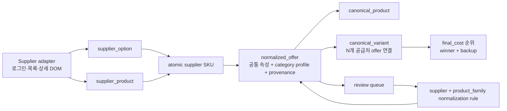

# Atomic supplier SKU 비교 엔진 설계안

이 문서는 구현 전 검증용 설계 및 migration 초안의 사용 범위를 정의한다. 이번 단계는 상세페이지 재수집과 dry-run 리포트 생성까지만 수행하며 WooCommerce, 운영 DB, 주문·결제·자동발주에는 쓰지 않는다.

## 경계와 데이터 흐름

공급처별 차이는 `SupplierAtomicAdapter`의 `listProducts`와 `fetchProductDetail`에만 둔다. 그 이후 수집, 정규화, canonical matching, 순위 계산 코드는 supplier ID를 데이터로만 다루며 이름 기반 분기문이 없다. supplier_c, supplier_d, supplier_e는 같은 인터페이스 구현만 추가하면 된다.

## 핵심 규칙

- 목록 시작가격은 비교 참고값이며 winner 계산에는 상세 옵션가격과 배송비의 합인 `final_cost`만 사용한다.
- 상세페이지의 구매 가능 선택지를 각각 atomic SKU로 만든다. ID는 `supplier_id + source_product_id + source_option_id`의 결정적 해시다.
- 광고 문구는 canonical key에서만 제거하고 원본 제목은 보존한다.
- 공통 속성과 품목별 `categoryProfile`을 분리한다. 미지원 품목도 공통 속성을 시도하되 핵심 규격이 없으면 `missing_spec` review로 보낸다.
- provenance는 각 속성의 source field, raw value, normalized value, extraction method, confidence, reason을 저장한다.
- 품질 기대치가 다른 `특품/특A/A급`, `가정용/실속형`, `혼합과/랜덤과`는 canonical product key에서 분리한다.
- `중/중과`, `대/대과`처럼 숫자 없는 크기는 서로 다른 공급처 간 자동 동일 승인을 하지 않는다. 같은 key에 모이더라도 winner를 정하지 않고 review queue로 보낸다.
- promotion, preorder, sold out, expired, zero price는 원본과 가격 이력을 보존한다. 일반 active offer와 중복되는 promotion은 winner에서 제외한다. promotion만 존재하는 variant는 관리자 승인 없이는 공개 후보가 아니다.
- 동일 canonical variant에 연결된 모든 active offer를 `final_cost`, atomic SKU ID 순으로 정렬한다. 2개 공급처 전용 pairwise 비교가 아니다.

## Idempotency

- supplier product: `(supplier_id, source_product_id)` unique
- supplier option: `(supplier_product_id, source_option_id)` unique
- atomic SKU: 결정적 primary key와 input fingerprint
- normalized offer: atomic SKU당 1개
- canonical link: normalized offer당 1개, variant-offer 복합 primary key
- review: 정렬된 offer ID + conflict reason의 결정적 review key
- normalization rule: supplier + product family + match fingerprint unique
- 가격 이력: 관측값 fingerprint unique

같은 입력을 반복하면 UPSERT 대상이 같아지고 SKU, review, canonical link가 중복되지 않는다.

## 관리자 review queue

리포트 payload에는 양쪽 또는 N개 공급처의 원본 제목, 옵션명, 상세설명, 추출 속성과 provenance, 이미지, 충돌 이유, AI 제안을 포함한다. 선택지는 `same_variant`, `separate_variant`, `separate_product`, `exclude`, `missing_spec`이다. 선택 결과는 supplier + product_family 범위의 normalization rule로 저장하며 다음 수집부터 재사용한다.

## 영향 파일

- `src/atomic-sku/**`: supplier-neutral domain, normalization, comparison, adapters
- `src/reports/atomic-sku-dry-run-cli.ts`: 5개 품목 실제 상세 검증 및 JSON/Markdown 생성
- `tests/atomic-sku.test.ts`: idempotency, provenance, 모호 규격, N-way ranking, 안전 상태
- `migrations/001_atomic_sku_comparison_draft.sql`: 미적용 DB 초안
- `reports/atomic-sku/**`: 실행 시 생성되는 dry-run 결과

기존 WooCommerce 실행기, 상품명·옵션명·설명·이미지·재고 변경 코드, 주문·결제·자동발주 코드는 수정하지 않는다.
