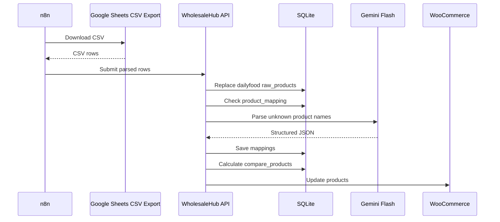
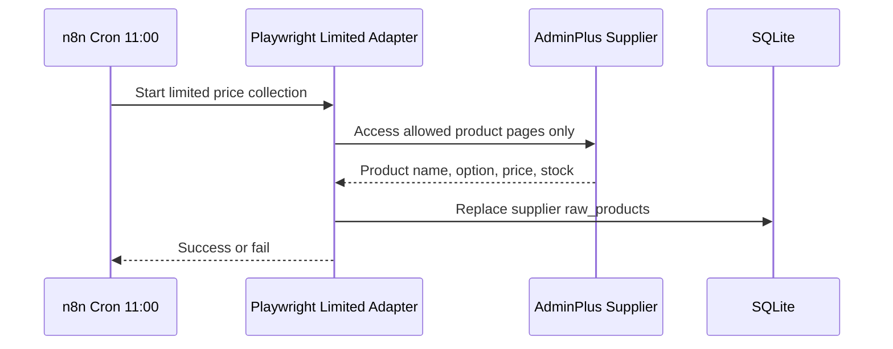

# Sequence Diagrams

## DailyFood Sync

```mermaid
sequenceDiagram
  participant N as n8n
  participant G as Google Sheets CSV Export
  participant A as WholesaleHub API
  participant DB as SQLite
  participant AI as Gemini Flash
  participant W as WooCommerce

  N->>G: Download CSV
  G-->>N: CSV rows
  N->>A: Submit parsed rows
  A->>DB: Replace dailyfood raw_products
  A->>DB: Check product_mapping
  A->>AI: Parse unknown product names
  AI-->>A: Structured JSON
  A->>DB: Save mappings
  A->>DB: Calculate compare_products
  A->>W: Update products
```

## AdminPlus Limited Sync

```mermaid
sequenceDiagram
  participant N as n8n Cron 11:00
  participant P as Playwright Limited Adapter
  participant S as AdminPlus Supplier
  participant DB as SQLite

  N->>P: Start limited price collection
  P->>S: Access allowed product pages only
  S-->>P: Product name, option, price, stock
  P->>DB: Replace supplier raw_products
  P-->>N: Success or fail
```
